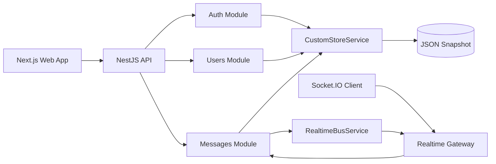
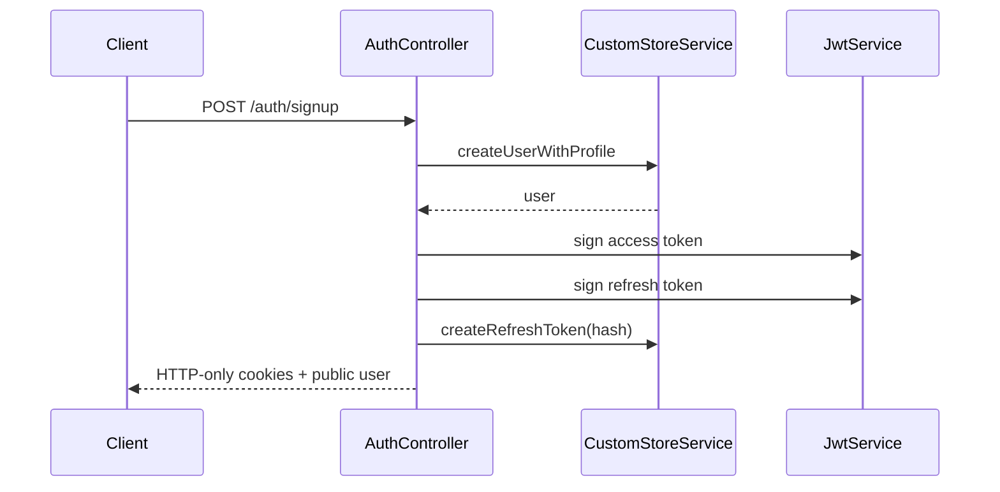
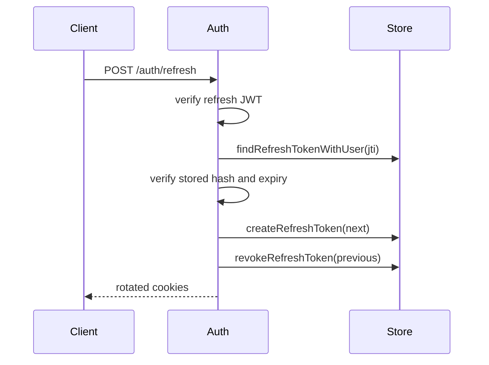
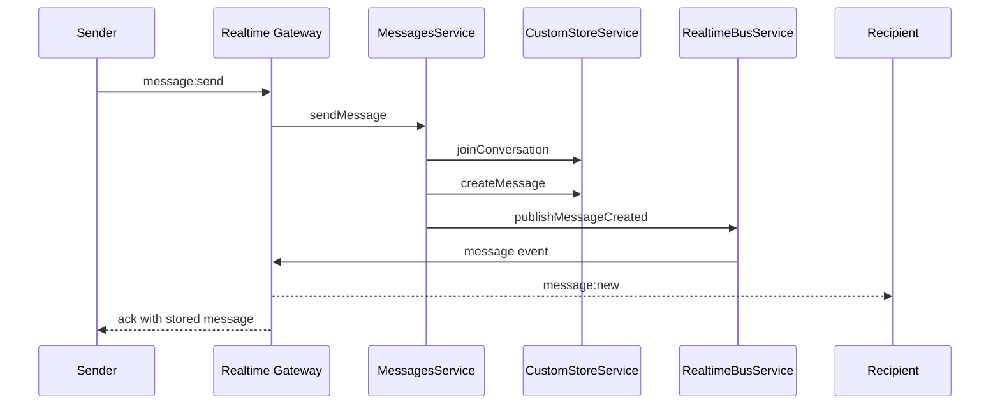

# Architecture

## Custom Runtime Stack

- Frontend: Next.js App Router, React, TypeScript, Tailwind CSS, TanStack Query, Zustand.
- Backend: NestJS with TypeScript as a modular monolith.
- Storage: custom JSON snapshot store with in-memory indexes and atomic writes.
- Realtime: Socket.IO gateway backed by a custom in-process event bus.
- Auth: JWT access tokens, hashed refresh-token records, HTTP-only cookies.
- Media/search/jobs: future modules can use the same storage boundary first, then move to stronger services only when needed.

This build intentionally avoids PostgreSQL, Redis, Prisma, and migrations. The
API owns persistence through `CustomStoreService`, so app modules never talk to a
third-party database client.

## High-Level Architecture



## Storage Model

The custom store keeps one versioned snapshot:

```text
{
  version,
  users,
  profiles,
  refreshTokens,
  conversations,
  conversationMembers,
  messages
}
```

Every mutation is serialized through a write chain, applied in memory, then
persisted by writing a temporary JSON file and renaming it over the snapshot.

Default path:

```text
work/custom-store/social-store.json
```

Override with:

```text
CUSTOM_STORE_PATH=/absolute/path/to/social-store.json
```

## Auth Flow



## Refresh Rotation



## Realtime Direct Message Flow



## Module Boundaries

- `AuthModule`: passwords, JWTs, refresh-token rotation.
- `UsersModule`: public profile read/update.
- `MessagesModule`: conversation membership, message persistence, HTTP message APIs.
- `RealtimeModule`: Socket.IO auth, room joins, message event handling.
- `StorageModule`: custom durable state and all write serialization.

## Trade-Offs

This custom runtime is simple to run and inspect, but it is single-process by
design. To harden it for serious production traffic, add snapshot encryption,
backup/restore, compaction, replayable append logs, process-level file locks,
observability, and a multi-node event distribution strategy.
